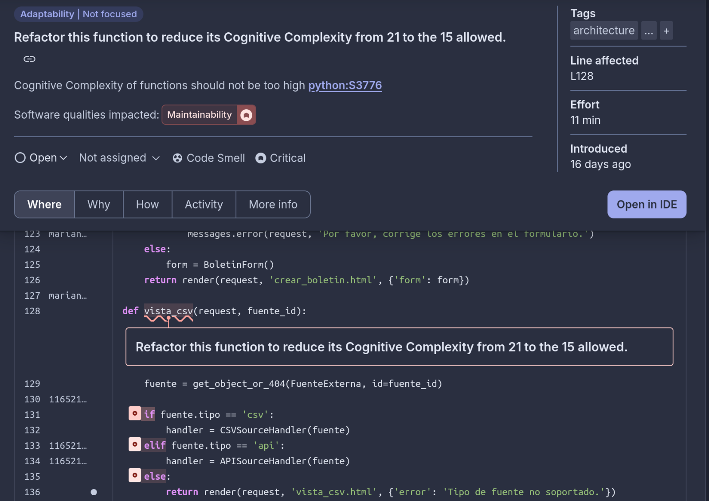
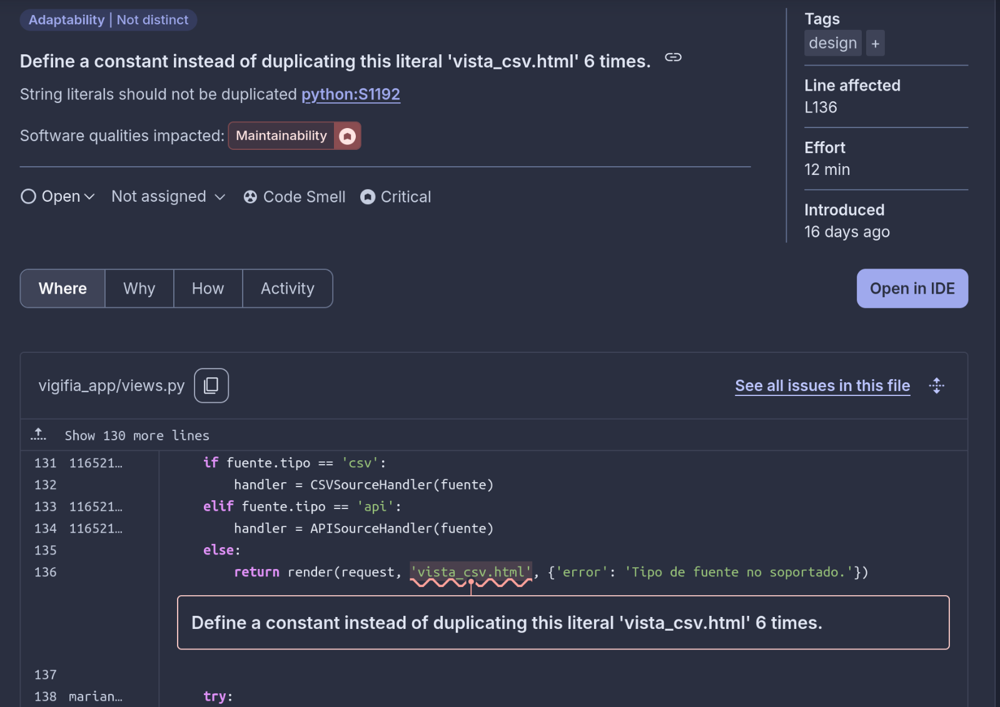

# Issue de Calidad 1: Complejidad Cognitiva Excesiva en `vista_csv`

## 

**Ubicación:** `vigifia_app/views.py`  
**Función:** `vista_csv`  
**Regla:** `python:S3776 - Cognitive Complexity of functions should not be too high`  
**Severidad:** `Crítica`   
**Complejidad actual:** 21  
**Complejidad permitida:** 15  
**Impacto:** Mantenibilidad

---

## Descripción del problema

La función `vista_csv`, encargada de procesar y mostrar contenido de fuentes CSV o API en la vista web, excede el umbral de **complejidad cognitiva permitido por Sonarqube**, lo que hace difícil su comprensión y mantenimiento.

Esto se debe principalmente a:

- Uso excesivo de condicionales anidados (`if`, `elif`, `else`).
- Lógica ramificada con múltiples casos para distintas estructuras de datos.
- Repetición de patrones de renderizado.

---

# Issue de calidad 2: Duplicación de Literales

## 

## Descripción

**Ubicación:** `vigifia_app/views.py`, línea 136  
**Regla:** `python:S1192 - Define a constant instead of duplicating this literal `'vista_csv.html'` 6 times.`   
**Severidad:** `Crítica`  
**Impacto:** Mantenibilidad

## Descripción del problema

El literal `'vista_csv.html'` se repite 6 veces en el método `vista_csv`, cada vez que se llama a `render()`. Esta práctica genera dificultades para mantener el código a largo plazo:

- Si se desea cambiar el nombre del template, se deben modificar múltiples líneas manualmente.
- Incrementa el riesgo de inconsistencias y errores tipográficos.
- Viola el principio DRY (*Don’t Repeat Yourself*).